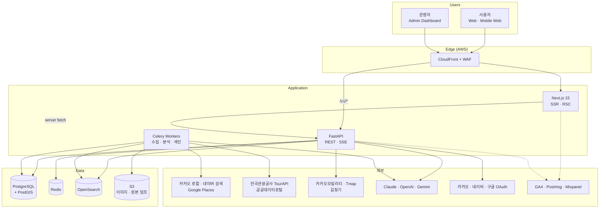
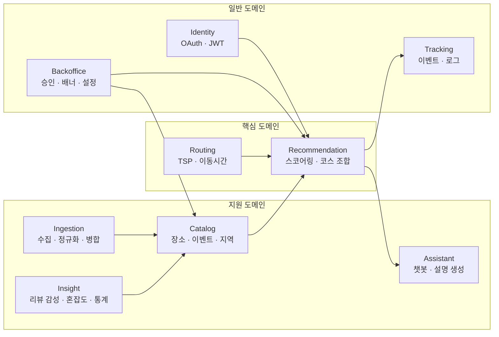
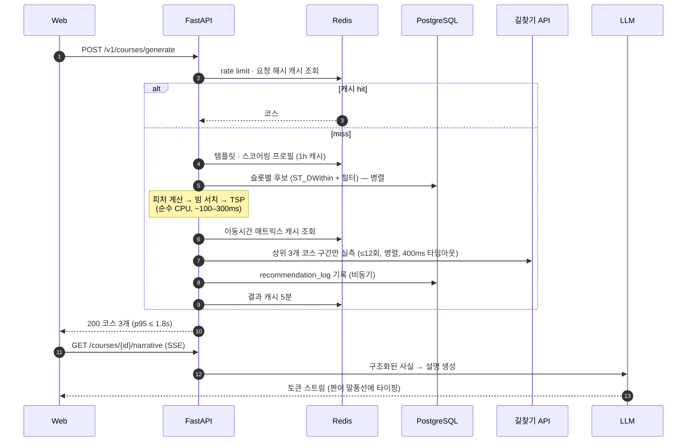
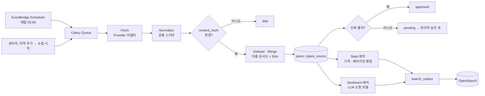

# 01. 서비스 구조도

## 1. 한 문장 정의

**내가짠데이** = 지역·예산·인원·목적을 넣으면, 실제 장소 데이터를 기반으로 **예산 안에서 가장 효율적인 하루 코스(식사→카페→관광→술집)와 동선**을 계산해 주는 코스 최적화 플랫폼.

"맛집 추천"과의 차이는 세 가지다.

| | 기존 지도/맛집 앱 | 내가짠데이 |
|---|---|---|
| 추천 단위 | 장소 1곳 | **코스 전체** (총액·총 이동시간이 보장됨) |
| 출발점 | 검색어 | **예산** |
| 결과 | 리스트 | 시간표 + 동선 + 남는 예산 + 이유 |

## 2. 시스템 컨텍스트

## 3. 논리 구성 (Bounded Context)

모놀리식이지만 **모듈 경계는 처음부터 MSA 후보 단위로** 나눈다 (→ `14-msa-migration.md`).

| 컨텍스트 | 책임 | 코드 위치 |
|---|---|---|
| Recommendation | 템플릿 선택, 피처 계산, 빔 서치, 대안 다양화 | `app/domain/recommendation` |
| Routing | 이동시간 매트릭스, Held-Karp / OR-Tools / 2-opt | `app/domain/routing` |
| Catalog | 장소·이벤트·지역·카테고리 CRUD, 검색 | `app/services/place_service`, `repositories/` |
| Ingestion | Provider 어댑터, 중복 병합, 가격 산출 | `app/infra/ingestion`, `app/workers` |
| Insight | 리뷰 감성 배치, 혼잡도 집계, 인기도 | `app/workers/tasks`, `app/prompts` |
| Assistant | LLM Provider 추상화, 프롬프트 레이어, tool-use 챗봇 | `app/infra/llm`, `app/services/chat_service` |
| Identity | OAuth2(PKCE), JWT rotation, RBAC | `app/core/security`, `services/auth_service` |
| Backoffice | 승인 큐, 배너, 스코어링 프로필 편집, 감사 로그 | `app/api/v1/admin` |

## 4. 요청 흐름 — 코스 생성 (핫패스)

설계 포인트
- **LLM은 핫패스 밖.** 코스는 LLM 없이 완성되고, 설명만 뒤따라 스트리밍된다. LLM 장애 = 설명이 템플릿 문장으로 바뀔 뿐.
- **외부 길찾기 API는 최종 후보에만.** 타임아웃 시 Haversine 추정치를 그대로 쓴다.
- 핫패스의 외부 의존은 전부 **폴백이 있다** (Redis 미스 → DB, ES 장애 → SQL 검색, 길찾기 장애 → 추정).

## 5. 데이터 흐름 — 수집 (콜드패스)

## 6. 기술 스택 요약

| 계층 | 선택 | 이유 |
|---|---|---|
| Web | Next.js 15 · TS · Tailwind v4 · shadcn/ui · Framer Motion · GSAP · Lottie | SSR로 공유 링크 OG/SEO, RSC로 초기 로드 최소화 |
| API | **FastAPI** (Python 3.13) | OR-Tools·수치 계산·LLM SDK 생태계가 파이썬. NestJS였다면 최적화 엔진을 별도 서비스로 빼야 했다 |
| Batch | Celery + Redis, EventBridge Scheduler | 수집·분석은 API와 독립 스케일 |
| DB | PostgreSQL 16 + PostGIS (+pgvector 선택) | 공간 질의가 핵심 워크로드 |
| Cache | Redis 7 | 후보·매트릭스·rate limit·세션 |
| Search | OpenSearch (nori) | 한국어 형태소 + geo |
| AI | Claude / OpenAI / Gemini 호환 Provider + 분리된 Prompt Layer | 벤더 종속 회피, 모델별 비용 최적화 |
| Infra | AWS ECS Fargate · RDS · ElastiCache · CloudFront · WAF · Terraform | 소규모 팀이 운영 가능한 매니지드 조합 |
| 분석 | GA4 · PostHog · Mixpanel (어댑터) | 하나의 `track()` 호출로 팬아웃 |

## 7. 데이터 수집에 대한 원칙 (중요)

네이버 플레이스·카카오맵·구글맵 **웹 화면을 크롤링하는 것은 각 서비스 약관과 저작권법·부정경쟁방지법상 리스크가 크다** (국내 판례상 DB 무단 크롤링은 손해배상 대상). 상용 서비스로 운영하려면:

1. **공식 Open API를 1순위**로 쓴다 — 카카오 로컬, 네이버 검색(지역), Google Places API, TourAPI, 공공데이터포털.
2. API가 주지 않는 **메뉴 가격·혼잡도**는 (a) 공공데이터(착한가격업소, 지자체 모범음식점), (b) 사용자 제보·방문 피드백(`actual_spend`), (c) 점주 직접 등록(제휴)으로 채운다. 이게 곧 서비스의 데이터 해자다.
3. 리뷰 **원문은 약관이 허용하는 출처만 저장**하고, 나머지는 평점·건수 집계만 쓴다. 감성 분석은 자체 리뷰와 허용된 출처에 대해서만 수행한다.
4. 각 API 약관의 캐시 기간(예: Google Places는 place_id 외 장기 저장 제한)을 `place_source.fetched_at` 기준 재수집 주기로 강제한다.

자세한 구조는 `07-data-pipeline.md`.
