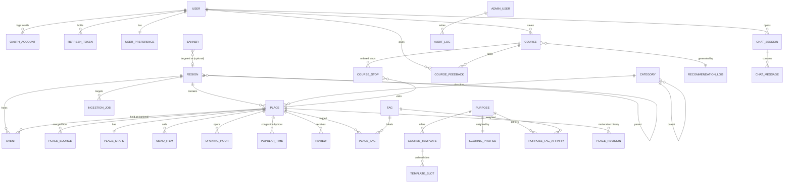

# 02. DB ERD

> PostgreSQL 16 + PostGIS 3.4 기준. 모든 테이블은 `id BIGINT GENERATED ALWAYS AS IDENTITY`(외부 노출용은 `public_id UUID`), `created_at`, `updated_at`을 가진다.
> **핵심 원칙: 지역·카테고리·목적·코스 템플릿·스코어링 가중치는 전부 "데이터"다.** 새 지역을 열 때 코드 배포가 필요 없다.

## 1. 전체 ERD



## 2. 테이블 정의

### 2.1 지역·분류 (데이터 드리븐의 핵심)

**`region`** — 계층형 지역. 새 지역 오픈 = 이 테이블에 row 추가 + 수집 잡 실행.

| 컬럼 | 타입 | 설명 |
|---|---|---|
| id | bigint PK | |
| parent_id | bigint FK→region NULL | 시/도 → 구 → 상권(핫스팟) |
| slug | text UNIQUE | `seoul-hongdae` — URL, API 파라미터에 사용 |
| name | text | `홍대입구` |
| level | smallint | 1=시도, 2=시군구, 3=상권 |
| center_lat, center_lng | double precision | 중심점 |
| radius_m | int | 기본 탐색 반경 |
| geog | geography(Point,4326) | 생성 컬럼(PostGIS), GIST 인덱스 |
| boundary | geography(MultiPolygon) NULL | 행정경계(있을 때만) |
| area_code | text NULL | TourAPI `areaCode/sigunguCode` 매핑 |
| status | text | `draft` / `collecting` / `active` / `paused` |
| search_keywords | text[] | 수집 시 사용할 키워드 (`홍대 맛집` 등) |

**`category`** — 계층형 카테고리. `course_role`이 코스 슬롯과의 연결 고리다.

| 컬럼 | 타입 | 설명 |
|---|---|---|
| id, parent_id | bigint | |
| code | text UNIQUE | `food.korean`, `cafe.dessert`, `attraction.park` |
| name | text | |
| course_role | text | `MEAL` `CAFE` `DESSERT` `ATTRACTION` `ACTIVITY` `CULTURE` `BAR` `NIGHTVIEW` |
| default_stay_min | int | 기본 체류시간 (경로 계산용) |
| provider_mapping | jsonb | `{"kakao":["FD6"],"google":["restaurant"],"tourapi":["A0502"]}` |

**`tag`**, **`place_tag(place_id, tag_id, weight, source)`** — 분위기/특성 태그(`조용한`, `뷰맛집`, `가성비`, `실내`, `우천OK`). 리뷰 분석으로 자동 부여(`source=llm`), 관리자가 수정(`source=admin`).

### 2.2 장소

**`place`** — 여러 출처를 병합한 정본(canonical).

| 컬럼 | 타입 | 설명 |
|---|---|---|
| id / public_id | bigint / uuid | |
| region_id, category_id | FK | |
| name, address, road_address, phone | text | |
| lat, lng | double precision | `CHECK (lat BETWEEN -90 AND 90)` |
| geog | geography(Point,4326) | 생성 컬럼, **GIST 인덱스** |
| price_per_person | int NULL | 1인 예상 지출(원). 메뉴 중앙값 기반 배치 계산 |
| price_tier | smallint | 1~4 |
| is_free | boolean | 공원·무료 전시 등 |
| description, thumbnail_url, images(jsonb) | | |
| status | text | `pending` `approved` `rejected` `hidden` `closed` |
| data_quality | real | 0~1. 필드 충족도·출처 수·신선도 |
| last_verified_at | timestamptz | |

인덱스: `GIST(geog)`, `(region_id, status, category_id)`, `(status, price_per_person)`.

**`place_source`** — 출처별 원본. 병합·재수집·감사의 근거.

| 컬럼 | 설명 |
|---|---|
| place_id FK NULL | 매칭 전에는 NULL |
| provider | `kakao_local` `naver_search` `google_places` `tourapi` `data_go_kr` `admin` `file` |
| external_id | UNIQUE(provider, external_id) |
| raw | jsonb — 원본 응답 그대로 |
| fetched_at, content_hash | 변경 감지(해시 동일하면 스킵) |
| match_confidence | real — 중복 병합 신뢰도 |

**`place_stats`** (1:1, 배치가 갱신)

| 컬럼 | 설명 |
|---|---|
| rating_avg, rating_count | 출처 가중 평균 |
| bayes_rating | 베이지안 보정 평점 (알고리즘 문서 참조) |
| sentiment_score | -1~1, 리뷰 감성 평균 |
| sentiment_count | 분석된 리뷰 수 |
| aspect_scores | jsonb `{"taste":0.8,"price":0.4,"mood":0.7,"service":0.5}` |
| popularity | real, 최근 90일 추천/저장/클릭 기반 |
| recommend_count, save_count, visit_feedback_avg | 자체 서비스 신호 |

**`menu_item(place_id, name, price, is_signature, source)`**
**`opening_hour(place_id, dow 0-6, open_time, close_time, break_start, break_end, is_closed)`**
**`popular_time(place_id, dow, hour, congestion 0~1, source)`** — PK(place_id, dow, hour)
**`review(place_id, provider, external_id, rating, content, written_at, sentiment, aspects jsonb, analyzed_at, model_version)`** — 약관상 저장 가능한 출처만 본문 저장. 그 외는 집계치만 `place_stats`에 반영.

**`event`** — 축제·전시·공연. `place_id`가 없어도 좌표를 직접 가진다.

| 컬럼 | 설명 |
|---|---|
| region_id, place_id NULL, category_id | |
| title, description, lat, lng, geog | |
| starts_on, ends_on | **기간 인덱스** `(region_id, starts_on, ends_on)` |
| price, is_free, booking_url, images | |
| provider, external_id | TourAPI `searchFestival` 등 |
| status | `pending` `approved` `ended` |

### 2.3 추천 설정 (전부 관리자 화면에서 수정)

**`purpose`** — `date`, `travel`, `family`, `friends`, `solo`, … (row 추가로 확장)

**`course_template`** / **`template_slot`**

| template_slot 컬럼 | 설명 |
|---|---|
| template_id, position | 슬롯 순서 |
| course_role | `MEAL` → `CAFE` → `ATTRACTION` → `BAR` |
| budget_share | 0~1, 템플릿 내 합=1 |
| is_optional | 예산 부족 시 제거 가능 |
| is_order_flexible | true면 TSP가 순서를 재배치 |
| earliest_start, latest_start | 시간창 (술집은 17:00 이후 등) |

`course_template`에는 `purpose_id`, `time_band`(`lunch`/`afternoon`/`evening`/`fullday`), `min_budget_per_person`, `party_min`, `party_max`, `is_active`.

**`scoring_profile`** — 목적별 가중치. **코드 수정 없이 튜닝.**

| 컬럼 | 설명 |
|---|---|
| purpose_id UNIQUE, version | |
| weights | jsonb `{"budget":0.24,"distance":0.12,"rating":0.16,"sentiment":0.14,"congestion":0.08,"time_fit":0.08,"preference":0.12,"purpose_fit":0.06}` |
| params | jsonb `{"budget_target_util":0.85,"budget_sigma":0.18,"distance_scale_m":900,"bayes_m":30,"lambda_travel":0.015,"lambda_overrun":2.0,"diversity_bonus":0.05}` |
| is_active, experiment_key | A/B 실험용 |

**`purpose_tag_affinity(purpose_id, tag_id, weight -1~1)`** — "데이트는 `조용한` +0.8, `단체석` -0.3".

### 2.4 사용자·코스

**`user`**(email, nickname, role `user`/`admin`/`operator`, status), **`oauth_account`**(provider `kakao`/`naver`/`google`, provider_user_id UNIQUE), **`refresh_token`**(token_hash, family_id, expires_at, revoked_at — rotation + 재사용 탐지)

**`user_preference`** — `liked_tags jsonb`, `disliked_tags`, `category_weights jsonb`, `taste_vector vector(64)`(pgvector, 선택), `default_transport`.

**`course`**

| 컬럼 | 설명 |
|---|---|
| public_id uuid | 공유 URL |
| user_id NULL | 비로그인 생성 허용 |
| region_id, purpose_id, template_id | |
| party_size, budget_total, transport | 입력 |
| total_price, total_travel_min, total_distance_m, total_score | 결과 |
| summary, narrative | LLM 생성 설명 |
| status | `generated` `saved` `shared` `completed` |
| recommendation_log_id | 재현용 |

**`course_stop`**(course_id, position, place_id | event_id, course_role, arrive_at, leave_at, est_price, travel_min_from_prev, distance_m_from_prev, score, score_breakdown jsonb, reason text)

**`course_feedback`**(course_id, user_id, rating 1-5, visited bool, actual_spend, comment, stop_feedback jsonb) — 선호도 학습 입력.

**`recommendation_log`** — 요청 입력, 후보 수, 사용한 `scoring_profile.version`, 엔진 버전, 지연시간, 선택된 코스. 월 단위 **파티션**. 통계·A/B·디버깅의 단일 출처.

**`chat_session`**, **`chat_message`**(role, content, tool_calls jsonb, tokens_in/out, model)

### 2.5 운영

**`banner`**(title, image_url, link_url, placement, region_id NULL, starts_at, ends_at, priority, is_active)
**`ingestion_job`**(provider, region_id, job_type `full`/`incremental`/`stats`/`sentiment`, status, cursor jsonb, fetched/created/updated/failed count, error, started_at, finished_at)
**`place_revision`**(place_id, admin_id, action `approve`/`reject`/`edit`/`merge`, before jsonb, after jsonb, note)
**`audit_log`**(actor_id, action, entity, entity_id, diff jsonb, ip, user_agent) — 파티션
**`api_key`**(파트너용, hash, scopes, rate_limit)

## 3. 공간 질의 예시

```sql
-- 중심점 반경 1.2km 내 승인된 식당, 1인 2만원 이하
SELECT p.id, p.name, ST_Distance(p.geog, :origin) AS dist_m
FROM place p
JOIN category c ON c.id = p.category_id
WHERE p.status = 'approved'
  AND c.course_role = 'MEAL'
  AND p.price_per_person <= 20000
  AND ST_DWithin(p.geog, :origin, 1200)
ORDER BY dist_m
LIMIT 200;
```

## 4. Redis 키 설계

| 키 | TTL | 용도 |
|---|---|---|
| `cand:{region}:{role}:{price_bucket}` | 10m | 후보 장소 ID 목록 |
| `tm:{mode}:{geohash7_a}:{geohash7_b}` | 7d | 이동시간 매트릭스 셀 |
| `course:{hash(request)}` | 5m | 동일 요청 결과 캐시 |
| `rl:{scope}:{id}:{window}` | window | Rate limit (sliding window) |
| `region:list`, `purpose:list` | 1h | 메타 (관리자 수정 시 즉시 무효화) |
| `jwt:deny:{jti}` | 토큰 만료까지 | 로그아웃 토큰 차단 |

## 5. Elasticsearch 인덱스

`places-v{n}` (alias `places`): `name`(nori + edge-ngram 자동완성), `category_code`, `course_role`, `tags`, `region_slug`, `location`(geo_point), `price_per_person`, `bayes_rating`, `sentiment_score`, `popularity`, `status`.
PostgreSQL이 **정본**이고, ES는 Outbox(`search_outbox` 테이블) → 워커로 동기화한다. 재색인은 새 버전 인덱스 생성 후 alias 스왑(무중단).
