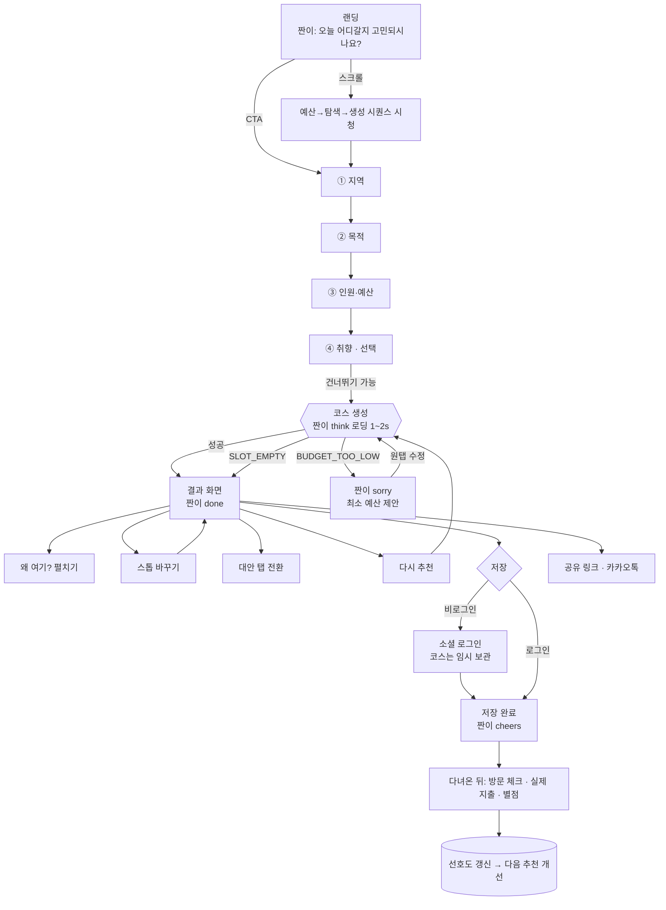
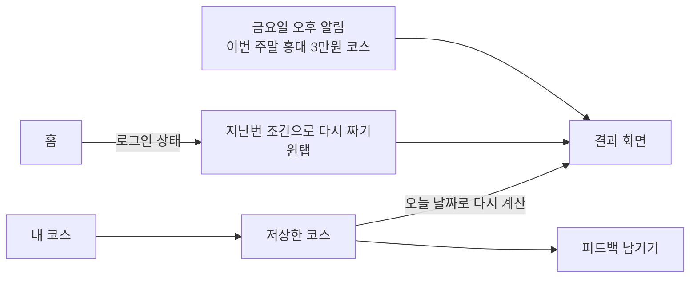
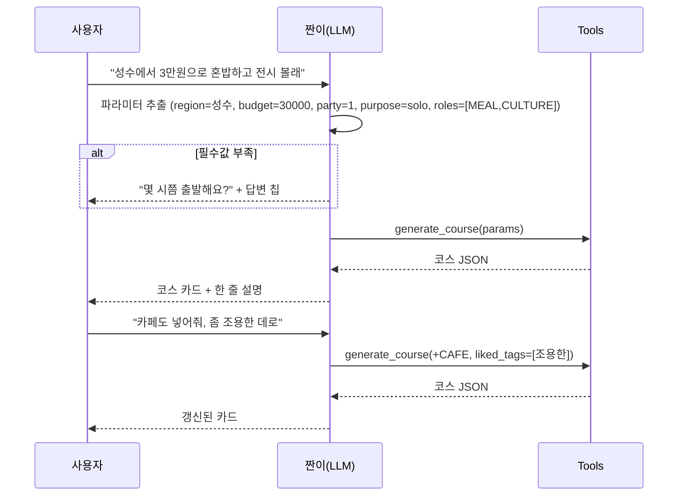
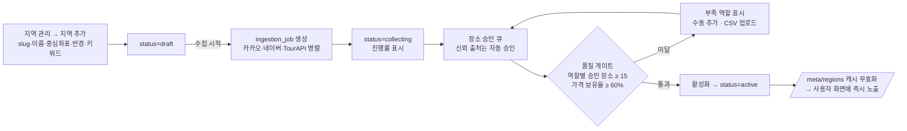

# 05. UX 플로우

## 1. 핵심 여정 — 첫 방문 → 코스 저장

### 설계 원칙

| 원칙 | 적용 |
|---|---|
| **가입 전에 가치부터** | 코스 생성·조회·공유는 비로그인 가능. 로그인은 "저장" 시점에만 요구하고, 로그인 후 원래 코스로 복귀(임시 코스 24h 보관) |
| **입력은 4탭 이내** | 필수는 지역·목적·예산 3개. 인원 기본 2, 취향은 스킵 가능. 목표: 랜딩 → 결과 **30초** |
| **기다림을 과정으로** | 로딩 중 짠이가 실제 단계("214곳 살펴보는 중")를 말한다. 1.5초짜리 로딩이 "일하고 있다"는 신뢰가 된다 |
| **결과는 수정 가능해야 믿는다** | 한 곳 바꾸기, 순서 드래그, 대안 코스 — 통제권을 준다 |
| **숫자는 항상 보인다** | 총액·남은 예산은 결과 화면 어디로 스크롤해도 sticky |
| **막다른 길 없음** | 모든 에러에 다음 행동 버튼 1개 (`04-screen-design.md` 5장) |

## 2. 재방문 여정

## 3. 챗봇 여정

챗봇은 **폼의 대체 입력 수단**이다. 결과는 항상 같은 엔진·같은 코스 카드로 귀결되므로 폼 사용자와 경험이 갈라지지 않는다.

## 4. 관리자 여정 — 신규 지역 오픈 (코드 배포 0회)

## 5. 이벤트 트래킹 설계 (GA4 · PostHog · Mixpanel 공통)

프론트는 `track(event, props)` 하나만 호출하고, 어댑터가 3곳에 팬아웃한다. 이벤트 이름·속성은 `apps/web/src/lib/analytics/events.ts`에 타입으로 고정한다.

| 이벤트 | 주요 속성 | 퍼널 단계 |
|---|---|---|
| `landing_viewed` | `referrer`, `utm_*` | 유입 |
| `hero_sequence_completed` | `mode: scroll\|auto` | 관심 |
| `plan_started` | `entry: hero\|nav\|chat` | 시작 |
| `plan_step_completed` | `step`, `value_bucket` | 입력 |
| `course_generated` | `region`, `purpose`, `party_size`, `budget_bucket`, `latency_ms`, `stops`, `warnings` | **활성화** |
| `score_breakdown_opened` | `position`, `role` | 신뢰 |
| `stop_swapped` | `position`, `strategy` | 조정 |
| `alternative_viewed` | `label` | 조정 |
| `reroll_clicked` | `nth` | 불만족 신호 |
| `course_saved` | `course_id`, `is_first` | **전환** |
| `share_clicked` | `channel` | 바이럴 |
| `feedback_submitted` | `rating`, `visited`, `spend_diff_pct` | 리텐션·학습 |
| `chat_message_sent` | `turn`, `has_course` | |

북극성 지표: **주간 저장 코스 수(WSC)**. 보조: 생성→저장 전환율, 예산 정확도, D7 리텐션.

개인정보: 위치는 지역 slug 단위로만 전송, 사용자 식별자는 해시, 분석 SDK는 동의 배너 이후 로드.

## 6. 반응형 동작 차이

| 요소 | Mobile | Tablet | Desktop |
|---|---|---|---|
| 내비게이션 | 하단 탭(홈·짜기·탐색·짠이·MY) | 상단 바 | 상단 바 |
| Hero 시퀀스 | 자동 재생, pin 없음 | 스크롤 scrub | 스크롤 scrub + 자동 루프 |
| 위저드 | 1열, CTA 하단 고정 | 1열 넓게 | 2열(입력 + 짠이/요약) |
| 결과 | 지도 + 바텀시트 | 지도 sticky + 리스트 | 좌 지도 / 우 타임라인 |
| 스왑 메뉴 | 바텀시트 | 팝오버 | 팝오버 |
| 관리자 | 읽기 전용 카드 뷰 | 사이드바 접힘 | 사이드바 + 테이블 |
