# 06. 추천 알고리즘 · 경로 최적화

> 구현 위치: `apps/api/app/domain/recommendation/` (순수 도메인, 프레임워크·DB 의존 없음 → 단위 테스트 100% 가능)
> 모든 가중치·파라미터는 `scoring_profile` 테이블에서 읽는다. 아래 숫자는 **초기 기본값**이다.

## 0. 파이프라인 한눈에

```mermaid
flowchart LR
    A[요청<br/>지역·예산·인원·목적·시간] --> B[1. 템플릿 선택<br/>purpose × time_band × 예산]
    B --> C[2. 슬롯별 예산 배분]
    C --> D[3. 후보 생성<br/>PostGIS 반경 + 하드 필터]
    D --> E[4. 장소 스코어링<br/>8개 피처 가중합]
    E --> F[5. 코스 조합<br/>Beam Search]
    F --> G[6. 동선 최적화<br/>OR-Tools / Held-Karp]
    G --> H[7. 재랭킹·다양화<br/>대안 코스 3개]
    H --> I[8. LLM 설명 생성]
    I --> J[응답 + recommendation_log]
```



LLM은 **점수를 매기지 않는다.** 선택은 결정적 알고리즘이 하고, LLM은 (a) 배치에서 리뷰 감성·태그 추출, (b) 결과 설명 문장 생성, (c) 챗봇의 자연어 → 요청 파라미터 변환만 담당한다. 그래야 결과가 재현 가능하고, 비용이 예측 가능하고, LLM 장애 시에도 추천은 동작한다.

## 1. 템플릿 선택 · 예산 배분

1. `course_template` 중 `purpose`, `time_band`, `party_size` 범위, `min_budget_per_person ≤ B/n` 을 만족하는 것을 고른다.
2. 1인 예산 `b = B / n`. 슬롯 s의 목표 예산 `b_s = b × budget_share_s`.
3. 예산이 빠듯하면(`b < min_budget`) `is_optional` 슬롯을 뒤에서부터 제거하고 share를 재정규화한다. 무료 슬롯(`ATTRACTION` 공원/산책)은 share 0으로 유지.

예) 데이트·저녁: `MEAL 0.55 → CAFE 0.20 → ATTRACTION 0.05 → BAR 0.20(optional)`

## 2. 후보 생성 (하드 필터)

슬롯마다 `region.center` 또는 사용자 위치에서 반경 `radius_m` 내:

- `status = approved`, `category.course_role = slot.role`
- `price_per_person ≤ 1.25 × b_s` (또는 `is_free`)
- 도착 예상 시각에 **영업 중** (`opening_hour`, 브레이크타임 제외)
- 인원 수용 가능(태그 `단체석` 등, 6인 이상일 때)
- 사용자가 제외한 태그/장소 아님
- `ATTRACTION`/`CULTURE` 슬롯은 `event` 중 **오늘 진행 중**인 축제·전시도 후보에 포함

후보가 5개 미만이면 반경을 1.5배씩 최대 2회 확장한다. 그래도 없으면 슬롯을 비우고 `warnings`에 기록한다(빈 화면에서 짠이가 안내).

## 3. 장소 스코어 — 8개 피처

모든 피처는 `[0,1]`로 정규화한다.

```
S(p | ctx) = Σ_k  w_k · f_k(p, ctx)        ,  Σ w_k = 1
```

| k | 피처 | 기본 w | 정의 |
|---|---|---|---|
| budget | 예산 적합도 | 0.24 | 아래 3.1 |
| distance | 거리 적합도 | 0.12 | `exp(-d / d0)`, d0 = 도보 900m · 대중교통 2.5km · 차량 6km |
| rating | 평점 | 0.16 | 베이지안 평점 → `clip((R_b − 3.0) / 2.0, 0, 1)` |
| sentiment | 리뷰 감성 | 0.14 | 아래 3.3 |
| congestion | 혼잡도 | 0.08 | `1 − congestion(dow, hour_arrive)`; 데이터 없으면 0.5 |
| time_fit | 시간대 적합 | 0.08 | 아래 3.4 |
| preference | 사용자 선호 | 0.12 | 아래 3.5 |
| purpose_fit | 목적 적합 | 0.06 | `purpose_tag_affinity`와 장소 태그의 가중 평균 → `(x+1)/2` |

### 3.1 예산 적합도 — "딱 맞게 쓰는 게 최고"

사용률 `u = price_per_person / b_s`.

```
u ≤ 1   :  f = exp( −(u − u*)² / (2σ²) )          u* = 0.85, σ = 0.18  (u < u* 쪽은 σ×1.6으로 완만하게)
1 < u ≤ 1.25 :  f = max(0, f(1) − 4·(u − 1))      초과는 급격히 감점
u > 1.25 :  하드 필터에서 제외
무료 장소 :  f = 0.9 (예산 슬롯 share ≤ 0.1 일 때) / 0.6 (그 외)
```

너무 싼 곳도 감점하는 이유: 4만원 예산에 3천원짜리 식당을 주면 "예산을 고려했다"는 느낌이 없다. 남는 예산은 코스 단계(5장)에서 다른 슬롯으로 이월된다.

### 3.2 베이지안 평점

리뷰 3개짜리 5.0점이 리뷰 800개짜리 4.5점을 이기지 못하게 한다.

```
R_b = (v · R + m · C) / (v + m)
v = 리뷰 수, R = 장소 평균, C = 해당 지역×카테고리 평균, m = 30
```

출처별 평점은 분포가 다르므로(네이버는 후하고 구글은 박하다) 출처별 z-score로 표준화 후 가중 평균한다.

### 3.3 리뷰 감성

배치 워커가 리뷰를 LLM(소형 모델)으로 분석해 `sentiment ∈ [−1, 1]`과 aspect(`taste`, `price`, `mood`, `service`, `wait`)를 저장한다.

```
s̄ = 최근성 가중 평균 (half-life 180일)
신뢰 축소:  s' = s̄ · n / (n + 15)
f_sentiment = (s' + 1) / 2
```

목적별 aspect 부스트: 데이트는 `mood`, 가족모임은 `service`, 혼밥은 `price`·`wait` 비중을 높인다(`scoring_profile.params.aspect_weights`).

### 3.4 시간대 적합

```
f_time = 0.6 · open_margin + 0.4 · peak_fit
open_margin = min(1, (마감까지 남은 분 − 체류시간) / 60)      # 문 닫기 직전 방문 방지
peak_fit    = 카테고리 역할별 선호 시간 곡선 (BAR: 19~23시 1.0, NIGHTVIEW: 일몰 후 1.0 …)
```

### 3.5 사용자 선호 (콜드스타트 포함)

- 로그인 사용자: `user_preference.category_weights`·`liked_tags`와 장소 태그 벡터의 코사인 유사도. 피드백(`course_feedback`)이 들어올 때마다 지수이동평균으로 갱신 (`α = 0.2`).
- 비로그인/신규: 온보딩 칩 선택값 → 없으면 **목적 프로필의 사전분포**(같은 목적 사용자들의 평균 선호)로 대체, 그마저 없으면 0.5.
- 탐색 보너스: 최근 30일 추천 노출 상위 5% 장소는 `−0.03`, 승인 14일 이내 신규 장소는 `+0.03` (인기 쏠림 방지).

## 4. 코스 목적함수

```
maximize  J(course) =  mean_i S(p_i)
                     − λ_t · (총 이동시간[분] / 슬롯 수)          λ_t = 0.015
                     − λ_o · max(0, Σprice_i − b) / b             λ_o = 2.0
                     + δ · diversity(course)                      δ = 0.05
                     + ρ · budget_utilization_bonus               ρ = 0.05  (총 사용률 0.8~1.0일 때)

subject to  Σ price_i ≤ 1.05 · b            (5% 허용, 초과분은 결과에 명시)
            각 구간 이동시간 ≤ T_max(mode)  (도보 20분 / 대중교통 35분 / 차량 40분)
            도착시각 ∈ 영업시간 & 슬롯 시간창
            같은 세부 카테고리 중복 금지 (diversity 하드 제약)
```

## 5. 코스 조합 — Beam Search

슬롯 수 4, 슬롯당 후보 K=12면 전수조사가 20,736개 × 시간창 검증이다. 가능은 하지만 슬롯이 6개(여행 풀데이)면 300만 개가 되므로 빔 서치를 쓴다.

```
beam = [빈 코스]                      # 폭 W = 40
for slot in template.slots:
    cands = top-K(slot) by S          # K = 12
    next = []
    for partial in beam:
        for p in cands:
            if 제약 위반(예산 누적, 구간 이동시간, 영업시간, 중복): continue
            # 남은 예산 이월: 앞 슬롯에서 아낀 돈은 뒤 슬롯 b_s에 더해 재스코어
            next.append(partial + p, J_partial)
    beam = top-W(next)
return top-N(beam)                    # N = 3 (추천 1 + 대안 2)
```

- **예산 이월**이 포인트다. 식당에서 4천원을 아꼈다면 카페 슬롯의 `b_s`가 그만큼 늘어난 상태로 `f_budget`을 다시 계산한다.
- 대안 코스는 1순위와 장소가 50% 이상 겹치지 않도록 MMR(Maximal Marginal Relevance)로 고른다. 라벨: `가성비 코스` / `평점 우선 코스` / `덜 걷는 코스` (각각 weights를 살짝 비튼 프로필로 재실행).

## 6. 동선 최적화 — TSP with Time Windows

템플릿 슬롯 중 `is_order_flexible = true`인 구간(예: 여행 코스의 관광지 3곳)은 방문 순서를 최적화한다. 식사→카페→술집 같은 **의미 순서는 선행 제약(precedence)으로 고정**한다.

### 6.1 모델

- 노드: 출발지(사용자 위치/역) + 선택된 장소들. 도착지는 자유(open-ended path) → 더미 종점으로의 비용 0.
- 비용: `c_ij = travel_min(i,j) + α · transfer_penalty`
- 시간 차원: `cumul_j ≥ cumul_i + stay_i + travel_ij`, `cumul_j ∈ [open_j, close_j − stay_j] ∩ slot_window`
- 선행 제약: `cumul(MEAL) ≤ cumul(CAFE) ≤ cumul(BAR)`
- 목적: 총 이동시간 최소화 (+ 만족도는 5장에서 이미 최대화된 집합이 입력)

### 6.2 솔버 선택

| 조건 | 솔버 |
|---|---|
| 노드 ≤ 9 | **Held-Karp DP** (정확해, `O(n²·2ⁿ)`, 순수 파이썬 1ms~30ms) — 외부 의존 없음 |
| 노드 > 9 또는 시간창/선행 제약 복합 | **Google OR-Tools Routing** (`PATH_CHEAPEST_ARC` → `GUIDED_LOCAL_SEARCH`, 제한 300ms) |
| OR-Tools 미설치/타임아웃 | Nearest-Neighbor + 2-opt 폴백 |

`RouteOptimizer` 프로토콜 하나에 세 구현체를 두고 팩토리가 고른다.

### 6.3 이동시간 매트릭스

`TravelTimeProvider` 인터페이스:

| 구현 | 용도 |
|---|---|
| `HaversineEstimator` | 기본값·폴백. 직선거리 × 우회계수(도보 1.3, 차량 1.4) ÷ 평균속도(도보 4.5km/h, 대중교통 18km/h, 차량 22km/h 도심) |
| `KakaoMobilityProvider` | 차량 길찾기 |
| `TmapProvider` / `GoogleRoutesProvider` | 도보·대중교통 |

후보 단계(수백 쌍)는 Haversine으로, **최종 상위 3개 코스의 구간만** 실제 API로 재계산한다 → API 호출 요청당 ≤ 12회. 결과는 geohash7 쌍으로 Redis에 7일 캐시.

## 7. 결과 설명 (LLM)

입력은 **구조화된 사실만** 전달한다: 장소명, 가격, `score_breakdown` 상위 2개 피처, 이동시간, 남은 예산. 프롬프트는 `apps/api/app/prompts/course_narrative.v1.yaml`. 출력은 JSON 스키마 강제(`summary`, `stops[].reason`, `tip`). LLM이 실패하면 템플릿 문장으로 폴백한다 — 사용자는 차이를 모른다.

> 짠이: "짠! 둘이서 36,000원 코스 나왔어요. 4,000원 남으니까 디저트 하나 더 어때요?"

## 8. 평가 · 개선 루프

| 지표 | 정의 | 목표 |
|---|---|---|
| Course Save Rate | 저장 / 생성 | ≥ 25% |
| Budget Accuracy | `|실제 지출 − 예상| / 예상` (피드백 기준) | ≤ 12% |
| Re-roll Rate | "다시 추천" 클릭 / 생성 | ≤ 35% |
| Visit Rate | 방문 체크 / 저장 | ≥ 40% |
| p95 Latency | 코스 생성 API | ≤ 1.8s (LLM 설명은 스트리밍으로 별도) |

- 오프라인: `recommendation_log` 리플레이로 가중치 변경 전후 비교(저장된 코스를 정답으로 NDCG 계산).
- 온라인: `scoring_profile.experiment_key` + PostHog feature flag로 A/B.
- 중기 로드맵: 피드백이 5만 건 넘으면 가중합을 LightGBM LambdaMART(learning-to-rank)로 교체. 피처 정의는 그대로 재사용되도록 `FeatureExtractor`를 분리해 뒀다.
