# 07. 데이터 수집 구조

> 구현: `apps/api/app/infra/ingestion`, `apps/api/app/workers`
> 원칙: **하드코딩된 장소 목록은 없다.** 로컬 개발용 샘플조차 `data/seed/*.json` → `file` provider → 동일 파이프라인을 탄다.

## 1. 출처별 수집 방식

| 출처 | 방식 | 얻는 것 | 제약 · 주의 |
|---|---|---|---|
| **소상공인 상가(상권)정보** (data.go.kr 15083033) | **벌크 파일** (시도별 CSV zip, 키 불필요, 이용허락 제한 없음) | 전국 영업 중 업소: 상호, 업종 소분류, 도로명주소, WGS84 좌표 | **식당·카페·주점·놀거리의 1차 출처.** 분기 갱신. 메뉴·영업시간·평점 없음 → 가격은 `예상`(§2 벌크 경로) |
| **카카오 로컬 API** | Open API — **실시간 조회 전용, 저장 금지** | 검색·자동완성 보조, 지도 링크 | 2026 약관상 검색 결과의 DB 저장·재가공 불가 → **수집(ingestion) 출처에서 제외.** 호출 결과는 응답에만 쓰고 버린다 |
| **네이버 검색 API(지역)** | Open API — **실시간 조회 전용, 저장 금지** | 검색 보조 | 카카오와 동일: 2026 약관상 결과 저장 불가 → 수집 출처에서 제외 |
| **Google Places API (New)** | Open API | 평점, 리뷰 수, 영업시간, price_level, 사진 | **유료**, 필드 마스크로 과금 최소화. 약관상 place_id 외 데이터는 장기 캐시 제한 → 30일 주기 재수집 |
| **한국관광공사 TourAPI 4.0** | Open API (`areaBasedList`, `locationBasedList`, `searchFestival`, `detailIntro`) | 관광지·문화시설·축제·레포츠, 이용요금, 운영시간, 이미지 | 공공누리 유형 확인 후 이미지 사용. **관광지·축제의 1차 출처** |
| **Visit Korea / 지자체** | TourAPI 다국어 서비스, 지자체 문화행사 API(서울 열린데이터광장 등) | 전시·공연·행사 일정 | 지자체마다 스키마 상이 → provider별 normalizer |
| **공공데이터포털** | Open API / 파일 | 착한가격업소(메뉴·가격!), 모범음식점, 도시공원, 공영주차장, 유동인구 | **메뉴 가격의 합법적 출처.** 갱신 주기 월/분기 |
| 관리자 · 사용자 제보 | Admin UI, CSV 업로드, `POST /places/suggest` | 누락 장소, 가격 정정 | `pending` → 승인 필수 |
| 자체 피드백 | `course_feedback.actual_spend` | **실제 지출** → 가격 보정 | 3건 이상일 때 반영 |

### 웹 크롤링에 대하여

네이버 플레이스·카카오맵·구글맵의 **웹 화면 스크래핑은 구현하지 않는다.** 각 사 약관 위반이며, 국내에서 DB 무단 크롤링은 데이터베이스권 침해·부정경쟁행위로 배상 판결이 난 선례가 있다. 상용 SaaS가 이 리스크를 지면 투자·제휴 실사에서 걸린다.

크롤러가 필요한 경우는 **명시적으로 허용된 대상**뿐이다 — robots.txt와 약관이 허용하는 지자체·공공기관 행사 페이지, 제휴 점주가 제공한 메뉴판 URL. 이때는 `crawl` provider가 (a) robots.txt 준수, (b) 도메인당 1 req/s, (c) User-Agent에 연락처 명시, (d) 원본 URL·수집 시각 보관 규칙을 강제한다. 구조상 `PlaceProvider` 인터페이스만 구현하면 되므로 파이프라인은 동일하다.

메뉴 가격·혼잡도처럼 API가 주지 않는 데이터는 **공공데이터 + 사용자 피드백 + 점주 제휴 등록**으로 채운다. 남이 못 긁어 가는 이 데이터가 서비스의 해자가 된다.

## 2. 파이프라인 구조

```mermaid
flowchart TB
    subgraph Trigger
      S1[EventBridge Scheduler<br/>cron]
      S2[Admin: 지역 수집 시작]
      S3[Admin: CSV 업로드]
    end
    Trigger --> JOB[(ingestion_job)]
    JOB --> Q{{Celery: ingest 큐}}

    subgraph Worker["Ingestion Worker (Fargate Spot)"]
      direction TB
      F[1. Fetch<br/>PlaceProvider.fetch&#40;region, cursor&#41;<br/>격자 분할 · 페이지네이션 · 쿼터/백오프]
      N[2. Normalize<br/>RawPlace → CanonicalPlace<br/>좌표계 · 카테고리 매핑 · 전화/주소 정규화]
      H[3. Diff<br/>content_hash 비교 → 변경분만]
      D[4. Dedupe/Merge<br/>block: geohash7 · 이름 유사도 · 거리]
      U[5. Upsert<br/>place_source → place]
      F --> N --> H --> D --> U
    end
    Q --> F
    U --> RAW[(S3: raw dump<br/>provider/date/region.jsonl.gz)]
    U --> PG[(PostgreSQL)]

    PG --> B1{{stats 큐}} --> ST[가격 산출 · 베이지안 평점 · 인기도 · data_quality]
    PG --> B2{{nlp 큐}} --> SE[리뷰 감성 · 태그 추출<br/>LLM 소형 모델 · Batch API]
    ST & SE --> OUT[(search_outbox)] --> IDX[Indexer] --> OS[(OpenSearch)]
    ST --> INV[Redis 캐시 무효화]
```



### Provider 계약

```python
class PlaceProvider(Protocol):
    name: str                     # "kakao_local"
    trust_level: TrustLevel       # TRUSTED → 자동 승인 / UNTRUSTED → pending
    def fetch(self, region: RegionSpec, cursor: dict | None) -> AsyncIterator[RawPlace]: ...
    def normalize(self, raw: RawPlace, categories: CategoryMapper) -> CanonicalPlace: ...
```

새 출처 추가 = 이 프로토콜을 구현한 파일 1개 + `providers/__init__.py` 레지스트리 등록. 파이프라인·스키마 변경 없음.
새 **지역** 추가 = `region` row 1개. Provider들은 `region.center/radius/search_keywords/area_code`만 보고 수집한다 → **코드 변경 없음.**

### 중복 병합 (Entity Resolution)

같은 가게가 카카오·네이버·구글에 각각 있다.

1. **Blocking**: geohash7(≈150m) 같은 셀 + 인접 8셀만 비교
2. **유사도**: `0.5·name_sim + 0.3·dist_score + 0.2·phone_match`
   - `name_sim`: 정규화(공백·지점명·특수문자 제거) 후 Jaro-Winkler + 자모 분해 편집거리
   - `dist_score = max(0, 1 − d/50m)`
3. `≥ 0.85` 자동 병합 · `0.6–0.85` 관리자 "중복 의심" 큐 · `< 0.6` 신규
4. 필드 우선순위: 좌표·상호=카카오, 영업시간·평점=구글, 요금=TourAPI/공공데이터, 전부에 대해 `admin` 수정이 최우선(덮어쓰기 방지 플래그 `locked_fields`)

### 1인 예상 지출 산출 (`price.py`)

```
메뉴 있음     : 대표메뉴(is_signature) 중앙값, 없으면 전체 메뉴의 P40~P60 평균
                × 역할 계수 (MEAL 1.0, CAFE 1.15[음료+디저트 일부], BAR 2.2[안주 1 + 주류 2 / 인원])
메뉴 없음     : 같은 지역×세부 카테고리의 중앙값 × price_level 보정 → data_quality 감점
피드백 ≥ 3건  : 0.6·산출값 + 0.4·actual_spend 중앙값
```

가격 신뢰도가 낮은 장소는 결과 화면에 `예상` 배지를 붙이고, 스코어링에서 `data_quality`만큼 예산 피처를 0.5 쪽으로 수축시킨다.

### 전국 벌크 경로 (`ingestion/bulk/`)

지역 단위 `fetch` 계약과 별개로, 전국 공개 파일을 **스트리밍**으로 적재하는 경로다 (`python -m app.cli ingest-bulk …`).

| 단계 | 내용 |
|---|---|
| download | 포털의 다운로드 버튼과 같은 흐름만 따른다(파일데이터: `check-limit` → `fileDownload`, 표준데이터: CSV 페이지 API). 보안문자·로그인이 나오면 **우회하지 않고** 수동 절차를 출력한다. 모든 로더는 `--path` 로 수동 파일을 받는다. 원본은 저장소 밖(`%LOCALAPPDATA%\naegajjanday\raw`) |
| regions | 시도(1)·시군구(2)는 상가정보에서 계산(가장 밀집한 상권 중심 + 거리 90분위 반경), 핫스팟(3)은 `data/bulk/regions_kr.json`. 전부 DATA — 엔진 코드는 지역을 모른다 |
| map | 업종 소분류 → `category.provider_mapping.semas`(DATA). 매핑 없는 업종(구내식당·유흥주점·PC방·배달 비중 높은 치킨/피자 등)과 `bulk_rules.json` 의 상호 키워드(기사식당·출장·급식…)는 제외 |
| price | 메뉴가 없으면 `price_prior.json`(업종별 1인 예상가) × 시도 물가계수 → `place.price_is_estimated = true`. 착한가격업소는 실제 메뉴가의 중앙값(실측) |
| upsert | `(provider, external_id)` 키 + content hash. 2,000행 단위 트랜잭션, 재실행 시 변경분만 갱신, `--close-unseen` 으로 폐업 반영. 추정가는 실측가를 덮어쓰지 못한다 |
| dedupe | 출처 내: id. 출처 간: 정규화 상호 + 거리(기존 `dedupe.py` 점수)를 **격자 버킷(≈100 m)** 으로 사전 필터. 착한가격업소는 좌표가 없어 상가정보와 **도로명주소 조인**으로 좌표를 얻고, 같은 건물·같은 상호면 기존 장소에 가격·메뉴를 병합 |

영업시간·평점은 공개 데이터에 없다. 영업시간이 없으면 엔진은 "상시"로 보고(기존 동작) `peak_fit` 만 적용하며, 평점은 NULL 로 두어 모든 장소가 같은 prior 를 받는다 — **지어내지 않는다.**

## 3. 배치 스케줄

| 잡 | 주기 | 큐 | 내용 |
|---|---|---|---|
| `ingest_region(incremental)` | 매일 03:00 | ingest | 활성 지역 전체, 변경분만 |
| `ingest_region(full)` | 지역 오픈 시 / 월 1회 | ingest | 격자 전수 |
| `ingest_events` | 매일 06:00 | ingest | TourAPI 축제·지자체 행사, 종료 이벤트 `ended` 처리 |
| `refresh_google_fields` | 30일 롤링 | ingest | 약관상 캐시 기한 준수 |
| `refresh_stats` | 매시 | stats | 평점·인기도·`data_quality` |
| `analyze_reviews` | 매일 04:00 | nlp | 미분석 리뷰 → LLM **Batch API**(비동기·할인) |
| `aggregate_popular_times` | 매일 05:00 | stats | 자체 방문 피드백 + 공공 유동인구 → `popular_time` |
| `sync_search_index` | 상시 (outbox 폴링 5s) | index | |
| `verify_closed` | 주 1회 | ingest | 90일 미갱신 장소 재조회 → 폐업 `closed` |
| `purge_expired` | 매일 | stats | 탈퇴 유예 만료, 임시 코스, 오래된 raw |

스케줄 정의 자체도 `celery beat` 코드가 아니라 EventBridge Scheduler(Terraform) + `ingestion_job` row로 관리해 운영자가 Admin에서 즉시 재실행할 수 있다.

## 4. 신뢰성

- **멱등**: `UNIQUE(provider, external_id)` upsert, 잡은 `cursor` 저장으로 중단 지점부터 재개
- **쿼터**: provider별 토큰 버킷(Redis). 429/5xx는 지수 백오프 + jitter, 3회 실패 시 DLQ
- **격리**: 큐를 `ingest`/`stats`/`nlp`/`index`로 분리 → LLM 지연이 수집을 막지 않음
- **품질 게이트**: 잡 종료 시 `created/updated/failed` 비율 검사. 실패율 > 20% 또는 전일 대비 장소 수 −10%면 자동 반영 중단 + Slack 알림
- **감사**: 모든 원본을 S3에 jsonl.gz로 보관(90일) → 정규화 로직 수정 시 **재수집 없이 재처리**
- **관측**: 잡별 처리량·지연·API 비용을 CloudWatch 메트릭으로, Admin `수집` 화면에 노출

## 5. 데이터 품질 지표 (Admin 대시보드 노출)

| 지표 | 정의 | 활성화 기준 |
|---|---|---|
| 역할 커버리지 | 지역×course_role 승인 장소 수 | 각 ≥ 15 |
| 가격 보유율 | `price_per_person` 보유(추정 포함) / 유료 장소 | **100%** — 추정은 `price_is_estimated` 로 구분해 UI 에 `예상` 표시 |
| 가격 실측률 | 실제 메뉴가 보유(착한가격업소·점주 등록·피드백) / 전체 | 목표치 없음(추세만 관찰). 공개 데이터만으로 실측 60% 는 달성 불가 — 실측은 제휴·피드백으로 늘린다 |
| 영업시간 보유율 | | ≥ 70% |
| 신선도 | `last_verified_at` 60일 이내 비율 | ≥ 80% |
| 슬롯 공백률 | 추천 시 `SLOT_EMPTY` 발생 비율 | ≤ 3% |
