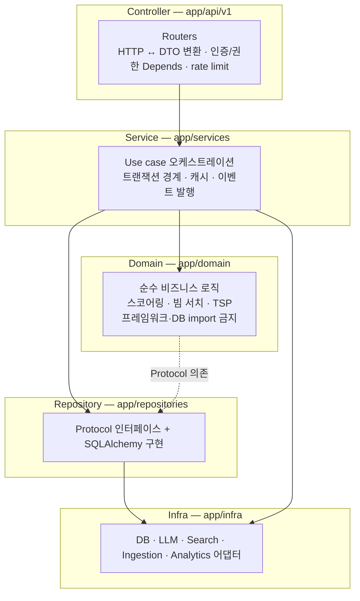
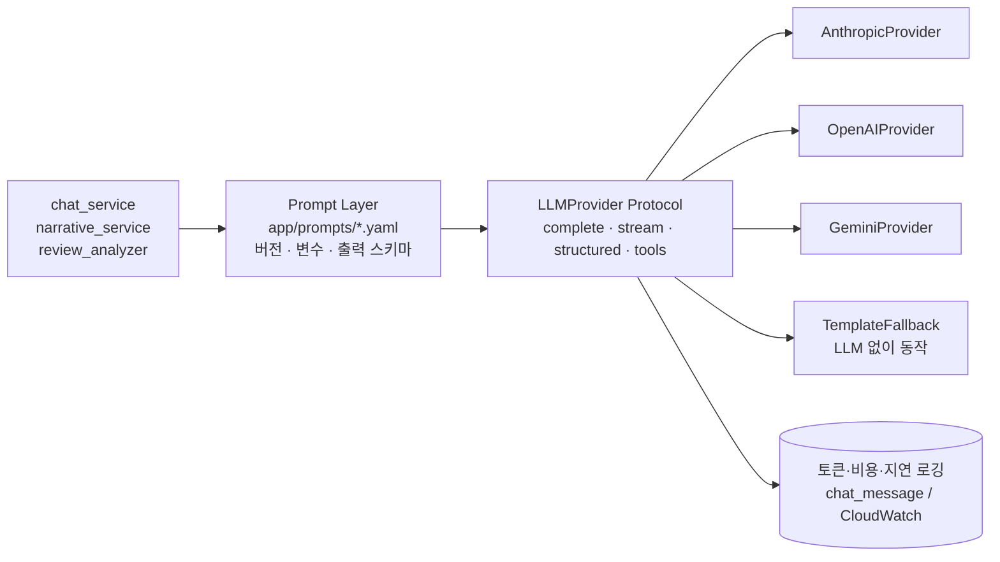
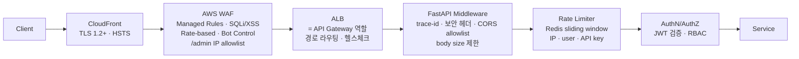

# 08. 서버 아키텍처 · 보안

## 1. 레이어드 아키텍처

| 규칙 | 강제 방법 |
|---|---|
| Controller는 Service만 호출, SQL·도메인 로직 금지 | 코드 리뷰 + `import-linter` 계약 |
| Domain은 아무것도 import하지 않음(표준 라이브러리만) | `import-linter`: `app.domain` → `fastapi/sqlalchemy/httpx` 금지 |
| Service는 Repository **Protocol**에 의존 | 테스트에서 인메모리 구현 주입 |
| DTO(Pydantic) ≠ ORM 모델 ≠ 도메인 dataclass | 계층 간 명시적 매핑 |

이 분리 덕에 추천 엔진은 DB 없이 밀리초 단위로 테스트되고, 나중에 엔진만 별도 서비스로 떼어낼 때(→ 14) 도메인 패키지를 그대로 들고 나간다.

## 2. 런타임 구성

| 프로세스 | 역할 | 스케일 기준 |
|---|---|---|
| `web` (Next.js standalone) | SSR, 정적 자산은 CloudFront/S3 | ALB 요청 수 |
| `api` (uvicorn × N workers) | REST + SSE | CPU 60%, 요청 수 |
| `worker-ingest` | 수집 (I/O bound) | 큐 길이, Fargate Spot |
| `worker-nlp` | 리뷰 감성 (LLM 대기) | 큐 길이, Spot |
| `worker-stats` / `indexer` | 집계, 색인 | 고정 1~2 |
| `migrate` | Alembic, 배포 시 1회성 태스크 | — |

- 코스 생성은 CPU 작업(빔 서치·TSP)이다. 이벤트 루프를 막지 않도록 `anyio.to_thread` / 프로세스 풀로 오프로드하고, 요청당 CPU 예산(300ms)을 넘으면 빔 폭을 줄여 조기 종료한다.
- SSE(설명·챗봇)는 ALB idle timeout 120s, 15s마다 heartbeat 코멘트.

## 3. AI 시스템 — Provider 추상화 + Prompt Layer

- **Prompt Layer 분리**: 프롬프트는 코드가 아니라 `prompts/<name>.v<N>.yaml` 자산이다. `system`, `user`(Jinja2), `output_schema`(JSON Schema), `model_tier`(`small`/`large`), `max_tokens`를 담는다. 서비스 코드는 `prompts.render("course_narrative", version=1, **facts)`만 호출한다. 프롬프트 수정 = YAML PR, A/B = 버전 병행.
- **모델 티어**: 서비스 코드는 모델명을 모른다. `small`(감성·태그 추출 배치) / `large`(설명·챗봇)만 지정하고, 티어→실제 모델 ID 매핑은 환경변수(`LLM_PROVIDER`, `LLM_MODEL_SMALL`, `LLM_MODEL_LARGE`).
- **Tool-use 공통 스키마**: 도구 정의는 JSON Schema 하나로 쓰고 provider가 각 사 포맷으로 변환한다.
- **가드레일**: 출력은 스키마 검증, 장소명은 입력 facts에 있는 것만 허용(후처리 검증), 실패 시 1회 재시도 → 템플릿 폴백. 사용자 입력은 system과 분리된 user 턴으로만 전달, 도구 실행 결과 외 데이터 접근 없음(프롬프트 인젝션 피해 범위 = 코스 추천뿐).
- **비용 통제**: 설명은 코스 해시로 24h 캐시, 배치는 Batch API, 시스템 프롬프트는 prompt caching, 사용자당 일일 토큰 상한.

## 4. 보안 아키텍처

### API Gateway 선택

ALB + WAF + 애플리케이션 레벨 rate limit 조합을 1차로 쓴다. AWS API Gateway는 SSE 스트리밍(29초 통합 타임아웃)과 비용(요청 100만 건당 과금) 때문에 핫패스에 맞지 않는다. **파트너 Open API**(`api_key` 기반)를 열 때 그 경로에만 API Gateway(usage plan·키 관리)를 붙인다.

### 인증

| 항목 | 설계 |
|---|---|
| 소셜 로그인 | OAuth2 Authorization Code **+ PKCE**, `state`(CSRF)·`nonce` 검증, redirect URI 화이트리스트. 카카오·네이버·구글 |
| Access Token | JWT RS256(키 로테이션 가능, `kid`), 15분, 클레임 `sub/role/jti/exp`. **메모리에만 보관**(XSS로 영구 탈취 불가) |
| Refresh Token | 불투명 난수 256bit, DB에는 SHA-256 해시만, 14일, `HttpOnly; Secure; SameSite=Lax` 쿠키, 경로 `/v1/auth` 한정 |
| Rotation | 갱신마다 새 refresh 발급·이전 것 폐기. **폐기된 토큰 재사용 감지 → 해당 family 전체 폐기 + 재로그인** |
| 로그아웃 | refresh 폐기 + access `jti`를 Redis denylist(잔여 TTL) |
| 관리자 | 별도 role + WAF IP allowlist + TOTP 2FA(2단계), 세션 30분 idle |

### Rate Limiting (다층)

1. **WAF rate-based**: IP당 5분 2,000건 — 볼류메트릭 방어
2. **앱 sliding window**(Redis Lua, 원자적): 엔드포인트별 한도(`03-api-spec.md` 1장). 비용이 큰 `courses/generate`, `chat`은 별도 버킷
3. **LLM 토큰 예산**: 사용자·IP당 일일 상한
4. 비로그인 남용은 IP + 디바이스 핑거프린트 해시 조합, 의심 시 Turnstile 챌린지

### 그 외

- **입력 검증**: Pydantic strict, 좌표·예산 범위 체크, 문자열 길이 상한, SQL은 전부 바인딩 파라미터
- **비밀 관리**: AWS Secrets Manager → ECS task 주입. 저장소·이미지에 비밀 없음(gitleaks CI)
- **데이터**: RDS·S3·ElastiCache 저장 암호화(KMS), 전송 TLS. 개인정보 최소 수집(이메일·닉네임), 위치 이력 미저장, 탈퇴 30일 후 파기, 접근 로그 1년(개인정보보호법 안전성 확보조치)
- **공급망**: Dependabot, `uv.lock`/`package-lock.json` 고정, Trivy 이미지 스캔, CodeQL
- **헤더**: CSP(nonce), `X-Content-Type-Options`, `Referrer-Policy`, `Permissions-Policy(geolocation=self)`
- **감사**: 관리자 쓰기 전부 `audit_log`(행위자·IP·diff), 변조 방지를 위해 S3 Object Lock 주기 백업

## 5. 관측성

| 축 | 도구 | 내용 |
|---|---|---|
| 로그 | structlog JSON → CloudWatch Logs | `trace_id`, `user_id(hash)`, `route`, `latency_ms`. PII 마스킹 필터 |
| 메트릭 | CloudWatch + EMF (`/metrics` Prometheus 호환) | RED(요청·에러·지연), 엔진 단계별 시간, 후보 수, 캐시 적중률, LLM 토큰·비용, 큐 길이 |
| 트레이스 | OpenTelemetry → AWS X-Ray | API → DB/Redis/외부 API 스팬. 샘플링 5% + 에러 100% |
| 에러 | Sentry (web·api) | 릴리스 태깅(git sha), 소스맵 |
| 제품 분석 | PostHog/GA4/Mixpanel | `05-ux-flow.md` 5장 |

**SLO**: 가용성 99.9%/월, 코스 생성 p95 ≤ 1.8s, 에러율 ≤ 0.5%. 에러 버짓 50% 소진 시 기능 배포 동결.
**알람**: 5xx > 1%(5분), p95 > 3s, RDS CPU > 80%, Redis eviction > 0, 수집 실패율 > 20%, LLM 일 비용 > 예산 120%.

## 6. 장애 대응 설계

| 장애 | 동작 |
|---|---|
| Redis 다운 | 캐시 미스로 간주·DB 직행, rate limit은 인메모리 근사치(fail-open, WAF가 1차 방어) |
| OpenSearch 다운 | 검색 → PostgreSQL `pg_trgm` 폴백. 코스 생성은 영향 없음(PostGIS 사용) |
| 길찾기 API 다운 | Haversine 추정 + 결과에 `예상 이동시간` 표기 |
| LLM 다운 | 서킷 브레이커 → 다른 provider로 페일오버 → 템플릿 문장 |
| RDS 페일오버(Multi-AZ, ~60s) | 커넥션 재시도, 읽기는 5분 캐시가 흡수 |
| 배포 불량 | ECS deployment circuit breaker 자동 롤백 |
