# 09. CI/CD 설계

> 구현: `.github/workflows/*` + `scripts/ci/{ecs-deploy,smoke}.sh`. 아직 워크플로에 없는 항목은 본문에 **(계획)** 으로 표시한다. 브랜치 전략은 **trunk-based** — 짧은 feature 브랜치 → PR → `main`. `main`은 항상 배포 가능 상태.

## 1. 파이프라인 전체

```mermaid
flowchart LR
    PR[Pull Request] --> CI
    subgraph CI["CI (경로 필터로 필요한 것만)"]
      direction TB
      A[ci-api<br/>ruff · mypy · pytest<br/>PostGIS+Redis 서비스 컨테이너<br/>docker build]
      W[ci-web<br/>eslint · tsc · build<br/>e2e 자리만 있음]
      I[ci-infra<br/>fmt · validate · tflint · checkov<br/>compose config 검증]
      S[security<br/>CodeQL · dependency-review<br/>trivy · gitleaks]
    end
    PR --> PV[preview<br/>Vercel 프리뷰 URL 코멘트]
    CI -->|전부 통과 + 리뷰 승인| M[merge → main]

    M --> B[Build & Push<br/>ECR · 태그 = git sha<br/>OIDC, 장기 키 없음]
    B --> MG1[DB migrate<br/>staging one-off task]
    MG1 --> DS[Deploy staging<br/>ECS rolling + circuit breaker]
    DS --> SM1[Smoke<br/>/readyz + 실제 코스 생성 1건]
    SM1 --> AP{{수동 승인<br/>GitHub Environment: production}}
    AP --> MG2[DB migrate prod]
    MG2 --> DP[Deploy prod<br/>rolling · min healthy 100%]
    DP --> SM2[Smoke]
    SM2 -->|실패| RB[자동 롤백<br/>이전 task definition]
    SM2 -->|성공| N[Slack 알림 · 잡 요약]
```



## 2. 워크플로

| 파일 | 트리거 | 내용 |
|---|---|---|
| `ci-api.yml` | PR · `main` push, `apps/api/**` | `uv sync --frozen` → ruff(check + format) → mypy → `alembic upgrade head` → pytest(커버리지, PostGIS·Redis 서비스) → docker build(푸시 없음). 골든 세트 추천 품질 diff는 **(계획)** |
| `ci-web.yml` | PR · `main` push, `apps/web/**` | `npm ci` → eslint → `tsc --noEmit` → `next build`. Playwright 잡은 `playwright.config.*`가 생기면 켜지는 자리표시자, Lighthouse는 `vars.ENABLE_LIGHTHOUSE=true`일 때만. 번들 크기 예산은 **(계획)** |
| `ci-infra.yml` | PR · `main` push, `infra/**` | `terraform fmt -check` → `validate`(스택별, 백엔드·자격증명 없이) → tflint → checkov(SARIF 업로드) → `docker compose config`(두 프로필). `plan` PR 코멘트는 AWS 계정 연결 후 **(계획)** |
| `security.yml` | PR · push · 주 1회(월 03:00 KST) · 수동 | CodeQL(python, js/ts), dependency-review, gitleaks, Trivy(api·web 이미지) |
| `preview.yml` | PR, `apps/web/**` | Vercel 프리뷰 배포 → URL을 PR에 코멘트 (staging API 연결). Vercel 토큰이 없으면 건너뜀 |
| `deploy.yml` | `main` push · 수동(`workflow_dispatch`) | 빌드·푸시 후 환경별로 `_deploy-environment.yml` 호출 |
| `_deploy-environment.yml` | `workflow_call` | 현재 task definition 기억 → 마이그레이션(one-off ECS 태스크) → api·worker·beat·web 롤링 → `smoke.sh` → 실패 시 전 서비스 롤백 → Slack |

공통: `concurrency` 그룹으로 같은 브랜치 중복 실행 취소, 잡별 최소 `permissions`, 액션 메이저 버전 고정, 캐시(uv·npm·docker layer).

## 3. 배포 전략

**ECS 롤링 업데이트 + Deployment Circuit Breaker**(자동 롤백)를 쓴다.

| 설정 | 값 | 의미 |
|---|---|---|
| `minimumHealthyPercent` | 100 | 기존 태스크를 유지한 채 새 태스크를 먼저 띄움 |
| `maximumPercent` | 200 | |
| 헬스체크 | ALB `/readyz` (DB·Redis 연결 확인) | 준비 안 된 태스크로 트래픽 안 감 |
| Circuit breaker | enable + rollback | 새 태스크가 연속 실패하면 ECS가 직전 버전으로 복귀 |
| deregistration delay | 30s (SSE 고려 120s까지) | 진행 중 요청 드레인 |

Blue/Green(CodeDeploy)을 쓰지 않는 이유: 무상태 서비스 + 하위호환 마이그레이션 원칙이면 롤링으로 충분하고, 리스너·타깃 그룹 이중화 복잡도를 피한다. **점진 노출은 인프라가 아니라 feature flag(PostHog)로** 한다 — 코드 배포와 기능 출시를 분리.

### DB 마이그레이션 — 무중단 3단계

```
릴리스 N   : expand   — 컬럼/테이블 추가(nullable), 신·구 코드 모두 동작
릴리스 N   : migrate  — 백필(배치), 신 코드가 새 컬럼 사용
릴리스 N+1 : contract — 구 컬럼 제거
```
- 마이그레이션은 배포 **전** one-off ECS 태스크로 실행. 실패 시 배포 중단.
- CI는 PostGIS 서비스 컨테이너에 `alembic upgrade head`를 적용한 뒤 테스트한다. `downgrade -1` 왕복 검증은 **(계획)**. 로컬에서는 `uv run alembic check`로 모델↔마이그레이션 차이를 본다.
- 긴 락을 유발하는 DDL(`ALTER … NOT NULL`, 인덱스)은 `CONCURRENTLY`/`NOT VALID` 패턴으로 쓴다. 자동 린트(squawk 등)는 **(계획)**, 그때까지는 PR 리뷰 항목.
- 마이그레이션은 자동 롤백되지 않는다. 그래서 expand/contract가 규칙이다.

## 4. 롤백

| 대상 | 방법 | 소요 |
|---|---|---|
| 애플리케이션 | 자동(circuit breaker · 스모크 실패 시 워크플로가 직전 task definition으로 복귀). 수동은 `git revert` → `main` push로 같은 파이프라인을 탄다 | 3~5분 / 10분 |
| 기능 | feature flag off | 즉시 |
| 추천 가중치·템플릿 | Admin에서 이전 버전 활성화 | 즉시 |
| DB 스키마 | expand 단계는 롤백 불필요(하위호환). contract는 1릴리스 지연이 안전장치 | — |
| 인프라 | `terraform apply` 이전 커밋 | 10~30분 |

## 5. 환경 · 시크릿

- GitHub Environments: `staging`(자동), `production`(승인자 2인 중 1인, `main`만 허용)
- AWS 인증은 **OIDC AssumeRole** — 저장소에 AWS 키 없음. role 신뢰 정책을 `repo:<org>/<repo>:environment:production`으로 제한
- 앱 시크릿은 Secrets Manager → ECS 주입. GitHub에는 배포에 필요한 식별자(role ARN, 클러스터 이름)만
- 프론트 공개 환경변수(`NEXT_PUBLIC_*`)는 `next build`가 번들에 박는다 → web 이미지는 **같은 git sha로 환경별 1회씩 빌드**한다(태그 `<sha>-staging` · `<sha>-production`). api 이미지는 하나를 그대로 승격한다. 런타임 설정 엔드포인트(`/config.json`)로 web도 단일 이미지화하는 것은 **(계획)**

## 6. 품질 게이트 요약

| 게이트 | 기준 | 차단 |
|---|---|---|
| 린트·타입 | 에러 0 | ✅ |
| 테스트 | 전부 통과, 커버리지 하락 없음 | ✅ |
| 추천 제약 | 예산 초과·역할 순서 위반 0 — 지금은 pytest 통합 테스트가 검증. 골든 세트 품질 diff는 **(계획)** | ✅ |
| 보안 | High 이상 취약점, 시크릿 검출 | ✅ |
| 번들 크기 **(계획)** | 랜딩 JS +10% 초과 | ⚠️ 경고 |
| Terraform | fmt · validate · tflint · checkov 통과. plan의 destroy 추가 승인은 **(계획)** | ✅ |
| 스모크 | `/readyz` + 코스 생성 200 | ✅ (자동 롤백) |

## 7. 개발자 경험

- 로컬: `scripts/dev.ps1`(Windows) / `Makefile` — `setup`, `api-dev`, `web-dev`, `worker-dev`, `migrate`, `seed`, `test`, `lint`, `fmt`, `compose-*`, `tf-validate`. 이 타깃들은 루트 `.env`(PostgreSQL 기준)를 읽는다. Docker 없이 SQLite로 돌릴 때는 `apps/api/README.md`의 명령을 직접 쓴다.
- `pre-commit`: 기본 위생 훅(yaml/json/toml · 개행 · private key 검출), ruff + ruff-format, prettier, terraform fmt, gitleaks.
- PR 템플릿: 변경 이유 · 테스트 방법 · 롤백 방법 · 스크린샷.
- 목표 리드타임: PR 머지 → staging 10분, → prod 승인 후 10분. 배포 빈도 주 3회 이상.
