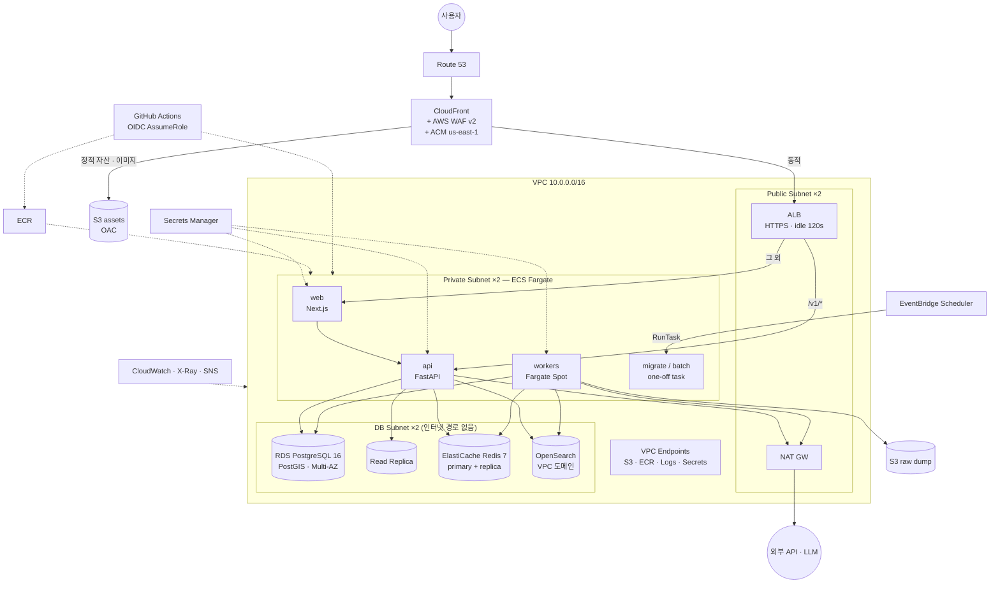

# 10. AWS 인프라 설계

> IaC: `infra/terraform` (모듈 + `envs/staging`, `envs/prod`). 리전 `ap-northeast-2`(서울), 2 AZ.

## 1. 구성도

## 2. 모듈 구성 (`infra/terraform/modules`)

| 모듈 | 리소스 | 비고 |
|---|---|---|
| `network` | VPC, 서브넷 3계층×2AZ, IGW, NAT, 라우팅, VPC 엔드포인트, Flow Logs | NAT: staging 1개 / prod AZ당 1개(변수) |
| `alb` | ALB, 리스너(443, 80→443), 타깃 그룹, 경로 규칙 | SSE 위해 idle timeout 120s. CloudFront 전용 헤더 검증으로 ALB 직접 접근 차단 |
| `ecs_service` | 태스크 정의, 서비스, 오토스케일, 로그 그룹, task/exec IAM role | web·api·worker가 재사용. Spot capacity provider 옵션 |
| `rds` | PostgreSQL 16, 파라미터 그룹, 서브넷 그룹, 백업, Performance Insights, 선택적 읽기 복제본 | PostGIS는 `CREATE EXTENSION`(마이그레이션에서 수행) |
| `elasticache` | Redis replication group, 전송·저장 암호화, AUTH | |
| `opensearch` | VPC 도메인, fine-grained access | nori는 AWS 제공 플러그인(`analysis-nori`) 사용 |
| `edge` | CloudFront, S3(OAC), Route53, WAF Web ACL | ACM 인증서는 us-east-1 provider alias |
| `observability` | 알람, SNS, 대시보드 | 08장 알람 목록 |
| `cicd_oidc` | GitHub OIDC provider, 배포 role(ECR push·ECS deploy 최소 권한) | 장기 액세스 키 없음 |

## 3. 환경

| | staging | prod |
|---|---|---|
| AZ / NAT | 2 AZ / NAT 1 | 2 AZ / NAT 2 |
| web · api | 각 1 태스크 (0.5 vCPU) | web 2~6, api 2~12 (오토스케일) |
| workers | Spot 0~1 | Spot 1~6 (큐 길이 기준) |
| RDS | db.t4g.small, Single-AZ, 백업 1일 | db.t4g.medium → r6g.large, **Multi-AZ**, PITR 7일, 삭제 보호 |
| Redis | t4g.micro ×1 | t4g.small ×2 (자동 페일오버) |
| OpenSearch | t3.small ×1 | t3.small ×2 → m6g.large ×3 |
| 가동 | 평일 09–21시(스케줄 중지) | 상시 |
| 계정 | **별도 AWS 계정** (Organizations) — 권한·비용·폭발 반경 분리 | |

State: S3(버전닝·암호화) + DynamoDB lock, 환경별 분리. 변경은 PR → `terraform plan` 코멘트 → 승인 후 apply.

## 4. 네트워크 · 보안

- **3계층 서브넷**: DB 서브넷은 인터넷 라우트 없음. 보안 그룹은 SG 참조 방식(ALB→web/api→DB)으로 최소 개방.
- **WAF 규칙**(우선순위순): ① `/admin`, `/v1/admin` IP allowlist 외 차단 ② AWS IP Reputation ③ Common Rule Set ④ Known Bad Inputs ⑤ SQLi ⑥ Rate-based(IP당 5분 2,000) ⑦ Bot Control(선택, 유료)
- **TLS**: CloudFront TLS 1.2+, HSTS preload. CloudFront→ALB도 HTTPS.
- **암호화**: RDS·ElastiCache·OpenSearch·S3·로그 전부 KMS. Secrets Manager 자동 로테이션(RDS 비밀번호 30일).
- **IAM**: 태스크별 role 분리(api는 raw S3 접근 불가, worker만 가능). 사람은 SSO + 최소 권한, prod 콘솔 쓰기는 break-glass role.
- **감사**: CloudTrail(조직 단위) → 별도 로그 계정 S3, GuardDuty, Security Hub, Config 규칙(퍼블릭 S3·미암호화 볼륨 탐지).
- ECS Exec는 prod에서 기본 비활성, 필요 시 세션 로그 남기고 임시 활성.

## 5. 가용성 · 복구

| 항목 | 설계 | 목표 |
|---|---|---|
| 컴퓨트 | 2 AZ 분산, 최소 2 태스크, 헬스체크 실패 시 자동 교체 | AZ 1개 장애 무중단 |
| DB | Multi-AZ 동기 복제, 자동 페일오버 60~120s | RPO 0 (AZ 장애) |
| 백업 | 일 스냅샷 + PITR 7일, 주 1회 **타 리전(도쿄) 스냅샷 복사** | 리전 장애 RPO 24h |
| Redis | 복제본 자동 승격. 캐시 전소 시에도 서비스 동작(성능만 저하) | |
| OpenSearch | 스냅샷 S3, 전소 시 PostgreSQL에서 재색인(정본은 PG) | |
| DR | Pilot light: Terraform으로 도쿄 리전 재구축 + 스냅샷 복원 | **RTO 4h / RPO 24h**, 연 1회 훈련 |
| 정적 페이지 | 오리진 장애 시 CloudFront 커스텀 에러 페이지(짠이 sorry) | |

## 6. 배치 실행 모델

상시 Celery beat 대신 **EventBridge Scheduler → ECS RunTask**를 기본으로 한다.

- 스케줄이 Terraform에 선언되어 리뷰·이력 관리됨
- beat 단일 장애점 없음, 유휴 비용 없음
- 같은 이미지로 `python -m app.cli ingest --all --mode incremental` 실행 → 잡을 큐에 넣고 종료, 실제 처리는 Spot 워커가 큐 길이에 따라 스케일

## 7. 왜 이 선택인가

| 결정 | 대안 | 이유 |
|---|---|---|
| **ECS Fargate** | EKS / EC2 | 노드 관리 0. 서비스 3~6개 규모에서 k8s 운영비(인력)가 이득보다 큼. 전환 경로는 열려 있음(→14) |
| **web도 ECS** | Vercel | API와 같은 VPC·WAF·관측 체계, 트래픽 증가 시 비용 예측 가능. 단, **PR 프리뷰는 Vercel**이 압도적으로 편해 병행 |
| **RDS PostgreSQL** | Aurora | 초기 비용 절반. 단계 3에서 Aurora로 이전(호환) |
| **OpenSearch** | Elastic Cloud / 자체 ES | VPC 통합·매니지드·nori 기본 제공. 베타에선 생략 가능(pg_trgm 폴백) |
| **ALB + WAF** | API Gateway | SSE 장시간 연결, 요청당 과금 회피(→08 4장) |
| **서울 단일 리전** | 멀티 리전 | 사용자 100% 국내. DR은 pilot light로 충분 |
