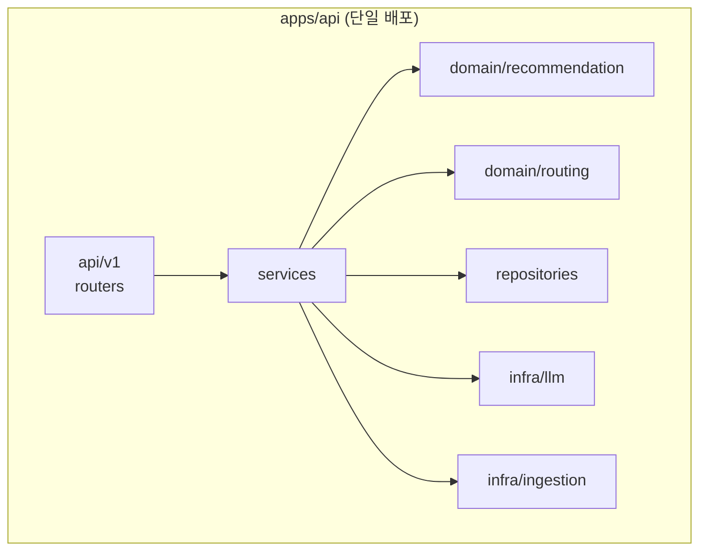
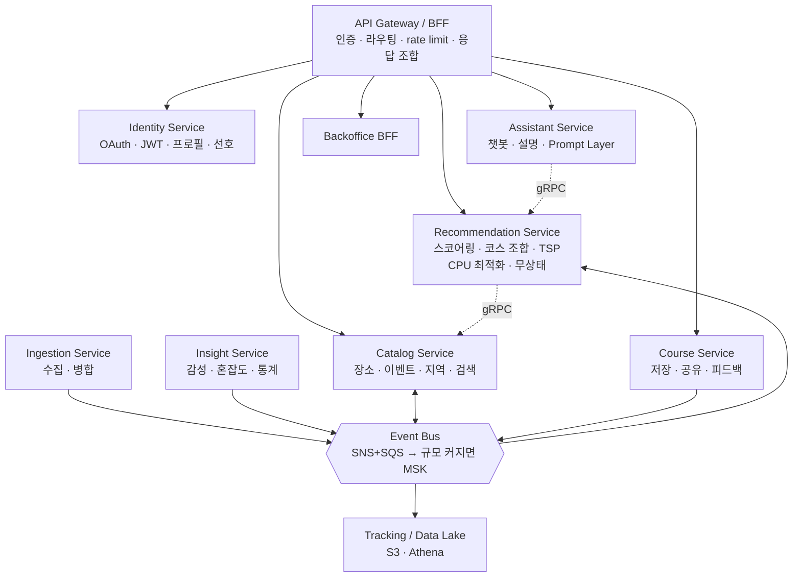
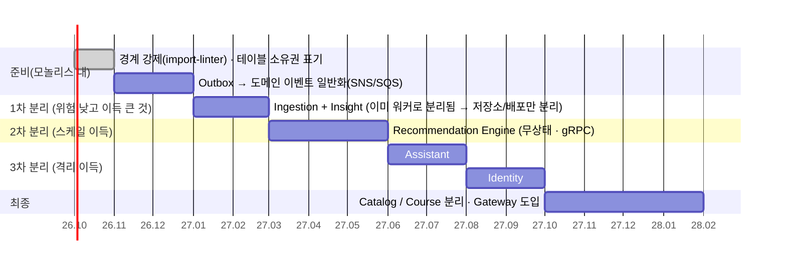

# 14. MSA 전환 전략

## 0. 결론부터

**지금은 모듈러 모놀리스가 맞다.** 3~6명 팀이 서비스 8개를 운영하면 기능 개발 시간의 절반이 분산 시스템 관리에 들어간다. 대신 **떼어낼 수 있게 짜 둔다** — 그리고 떼어낼 *이유가 생겼을 때만* 뗀다.

## 1. 분리 트리거 (이 중 하나가 실제로 발생하면)

| 신호 | 측정 | 분리 대상 |
|---|---|---|
| 스케일 특성 불일치 | 코스 생성 CPU 때문에 API 전체를 늘리는 비용이 월 100만원 이상 낭비 | Recommendation Engine |
| 배포 충돌 | 수집 로직 핫픽스가 주 2회 이상 API 배포를 막음 | Ingestion |
| 팀 분화 | 도메인별 전담 팀(각 4명+)이 생기고 PR 대기가 병목 | 해당 컨텍스트 |
| 장애 격리 필요 | 챗봇/LLM 장애가 코스 생성 SLO를 침범 | Assistant |
| 외부 공개 | 파트너 Open API의 SLA·과금을 독립 관리 | Partner Gateway |
| 기술 스택 이질성 | 실시간 협업(WebSocket 대량 연결)이 Python에 안 맞음 | Realtime (Node/Go) |

## 2. 현재 구조가 이미 보장하는 것

- 컨텍스트 간 호출은 **Service 인터페이스**를 통해서만 (import-linter 강제). 타 컨텍스트의 Repository·ORM 모델 직접 접근 금지.
- `domain/*`은 순수 파이썬 → 패키지째로 다른 서비스에 옮길 수 있음.
- 테이블은 컨텍스트별 **소유권**이 정해져 있고(아래 3장), 교차 조인은 Catalog 조회용 read model로 한정.
- 비동기 작업은 이미 큐(Celery) 뒤에 있음 → 워커는 사실상 별도 서비스.
- 색인 동기화는 **Outbox 패턴** → 이벤트 발행 인프라의 원형.

## 3. 목표 서비스 분할

| 서비스 | 소유 데이터 | 저장소 | 통신 |
|---|---|---|---|
| Catalog | region, category, place*, event, tag, banner | PostgreSQL+PostGIS, OpenSearch | gRPC(조회), 이벤트 발행 `place.updated` |
| Recommendation | course_template, scoring_profile, purpose*, recommendation_log | PostgreSQL(설정), Redis(**Catalog read model 캐시**) | gRPC in, 이벤트 구독 |
| Course | course, course_stop, course_feedback | PostgreSQL | REST, 이벤트 발행 `course.saved`, `feedback.submitted` |
| Identity | user, oauth_account, refresh_token, user_preference | PostgreSQL | REST, JWT 공개키(JWKS) 배포 |
| Assistant | chat_session, chat_message, prompts | PostgreSQL / DynamoDB | SSE, Recommendation 호출 |
| Ingestion | place_source, ingestion_job, raw(S3) | PostgreSQL, S3 | 큐, 이벤트 발행 `place.ingested` |
| Insight | review, popular_time, place_stats | PostgreSQL → 장기적으로 ClickHouse | 이벤트 구독·발행 `stats.refreshed` |

**핵심 설계**: Recommendation은 핫패스에서 Catalog를 동기 호출하지 않는다. `place.updated`/`stats.refreshed` 이벤트를 구독해 **자기 Redis에 지역별 후보 read model**을 유지한다(CQRS). 네트워크 홉이 p95를 망치는 것을 구조적으로 차단.

## 4. 전환 순서 — Strangler Fig

각 분리의 절차(동일 패턴 반복):

1. **인터페이스 고정** — 모놀리스 안의 Service Protocol을 그대로 gRPC/REST 계약으로 옮김
2. **원격 구현체 추가** — 같은 Protocol을 구현하는 `RemoteRecommendationClient` 작성
3. **섀도 트래픽** — 모놀리스 내부 구현과 신규 서비스에 동시 호출, 결과 diff 로깅(사용자에겐 기존 결과)
4. **카나리 전환** — feature flag로 1% → 10% → 50% → 100%, SLO 위반 시 즉시 플래그 롤백
5. **데이터 분리** — 같은 DB의 별도 스키마 → 별도 인스턴스 (dual-write 금지: 이벤트 기반 복제 후 cut-over)
6. **구 코드 삭제**

## 5. 분산 환경에서 풀어야 할 것

| 문제 | 해법 |
|---|---|
| 분산 트랜잭션 (코스 저장 + 통계 + 선호도 갱신) | **Saga(코레오그래피)**: `course.saved` 이벤트 → 각 서비스가 구독. 실패는 재시도 + DLQ, 보상은 멱등 핸들러 |
| 이벤트 유실·중복 | Transactional Outbox + at-least-once + 소비자 멱등 키(`event_id`) |
| 이벤트 스키마 진화 | JSON Schema/Protobuf 레지스트리, 하위호환만 허용, `version` 필드 |
| 서비스 간 인증 | mTLS(ECS Service Connect) + 내부용 짧은 수명 JWT. 사용자 컨텍스트는 Gateway가 검증 후 헤더 전달 |
| 서비스 디스커버리 | ECS Service Connect / Cloud Map (k8s 전환 시 Istio) |
| 분산 추적 | 이미 도입한 OpenTelemetry `trace_id`를 gRPC·이벤트 메타데이터로 전파 |
| 장애 전파 | 타임아웃·서킷 브레이커·벌크헤드. Recommendation은 Catalog read model 덕에 Catalog 다운에도 동작 |
| 로컬 개발 복잡도 | docker-compose 프로파일 + 나머지는 공유 dev 환경 연결(Telepresence류), 계약 테스트(Pact)로 통합 테스트 의존 축소 |
| 조회 조합(코스 상세 = 코스 + 장소 + 사용자) | Gateway/BFF에서 조합, 자주 쓰는 뷰는 비정규화 read model |

## 6. 플랫폼 선택

| 단계 | 플랫폼 | 이유 |
|---|---|---|
| 서비스 ≤ 6 | **ECS Fargate + Service Connect** 유지 | 운영 인력 0.5명으로 충분 |
| 서비스 > 8, 전담 플랫폼팀 존재 | EKS + ArgoCD(GitOps) + Karpenter | 세밀한 스케줄링·비용 최적화·서비스 메시 |
| 이벤트 | SNS+SQS → 처리량/순서 요구 커지면 MSK(Kafka) | 초기 운영 부담 최소 |

## 7. 하지 말아야 할 것

- 테이블마다 서비스 만들기 (엔티티 서비스 안티패턴) — 분할 기준은 **바운디드 컨텍스트와 팀**이다.
- 공유 DB를 둔 채 코드만 나누기 — 분산 모놀리스가 되어 단점만 얻는다.
- 핫패스에 동기 호출 체인 3단 이상 — 가용성은 곱셈으로 떨어진다(99.9%³ ≈ 99.7%).
- 트리거 없이 "언젠가 필요할 테니" 미리 분리하기.
